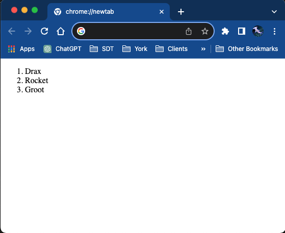

# Lists

Lists are used a lot in HTML, most commonly to make menus and navigation. They come in two types. Ordered lists have bullet points, and Unordered lists have numbers.

We make lists using the following elements:

- `<ol>` - wraps an ordered list
- `<ul>` - wraps an unordered list
- `<li>` - wraps an individual list item

An ordered list looks like this:

```html
<ol>
  <li>Drax</li>
  <li>Rocket</li>
  <li>Groot</li>
</ol>
```

In a browser this will look like this:



Note that this was an ordered list. I'm sorting the Avengers in order of coolness. Fight me.

<div class="exercise">

## Exercise - Mark up the cats

For this exercise, we will mark up a list of cat types as a bulleted list.

Why cats? I like cats. Use dogs if you're some sort of cat hater, I don't mind.

Use a list like the following:

```text
Persian
Siamese
Ragdoll
Pixie-Bob
Devon
Rex
```

1. Wrap the whole list in opening and closing unordered list tags `<ul> </ul>`. Doing this tells the web browser that all the elements belong to the same list.
2. Wrap each individual item on the list in list item tags `<li> </li>`. Doing this separates each list item, one from the other. When you've done this, view in your browser.
3. For extra credit, create a numbered list using the same data. Do this by changing the unordered list tag into an ordered list tag `<ol>`

Your final document should look like this:

- Persian
- Siamese
- Ragdoll
- Pixie-Bob
- Devon Rex

</div>

## Nested Lists

Lists can go inside other lists. We use this a lot for hierarchical navigation, or just for presenting information clearly.

A nested list looks like this:

```html
<ul>
  <li>
    Cats
    <ul>
      <li>Fluffster</li>
      <li>Flumwuzzler</li>
      <li>Flan Star</li>
    </ul>
  </li>
  <li>
    Cheeses
    <ul>
      <li>Gouda</li>
      <li>Camembert</li>
    </ul>
  </li>
</ul>
```

Nested lists are commonly used for site navigation elements. We can also use them to indicate levels in a structured document.

<div class="exercise">

## Exercise - Nested Lists

1. First enter and mark up the following list as an unordered list.

```text
Dogs
Cats
Hamsters
```

2. Now add the following sublist of types of dogs. Do this by creating a new ordered list and inserting it into the dogs list item, just before the closing `</li>` tag.

```text
Afghan Hound
Beagle
Norfolk Terrier
Lumphead
```

3. Now create similar lists for cats and hamsters.

Your final document should look something like this:

- Dogs
  - Afghan Hound
  - Beagle
  - Norfolk Terrier
- Cats
  - Persian
  - Siamese
  - Ragdoll
- Hamsters
  - Asyrian
  - Black Russian

</div>
