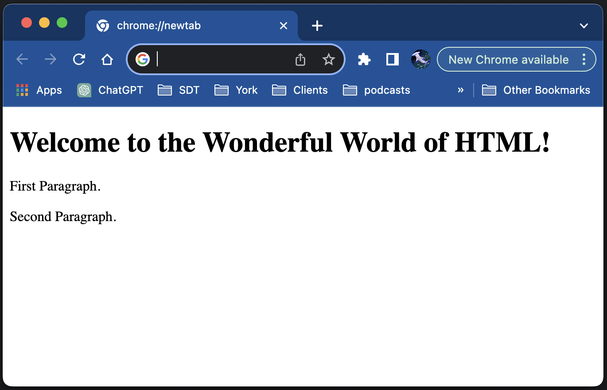

# Marking up a document

HTML is the language that web pages are created in. Rival technologies such as Flash and Shockwave have tried to challenge HTML in the past but none has matched it for simplicity, flexibility and ubiquitousness. Those technologies are all dead now, but HTML still stands.

HTML is a markup language. An ordinary text document is "marked up" using special pairs of tags which tell a piece of software called a web browser how the text should be displayed.

Browsers include Chrome, Firefox, Edge, Brave, Opera, etc. They are just computer programs that read an HTML document and turn it into nicely formatted pixels on the screen.

## Tags

A paragraph can be created in html by placing a `<p>` tag at the start of the paragraph, and a matching end `</p>`` tag at the end of the paragraph. We sometimes talk about "wrapping" text in p tags to create a paragraph.

When text has been wrapped in paragraph tags, we describe that text as a paragraph element. We are then able to apply specific styling to that paragraph element using CSS which we will come to later.

## Tags come in pairs

Tags generally come in pairs, a start tag and an end tag. A start tag looks like this: `<p>`. This tag means start a new paragraph. An end tag looks like this `</p>`. This tag means end your paragraph.

```html
<p>This is now a paragraph</p>
```

Tags are placed before and after the text we want to wrap, so if you wanted to make a top level heading you might write `<h1>Here is my heading</h1>`

## Lets make a web page

A web page at root is a simple text document. You can create one in any editor that allows you to write plain text. You might use Notepad, but most of us prefer a programmers text editor like [VSCode, which you can download for free from here](https://code.visualstudio.com/).

To create your blank page, just create a new file and save it as `index.html`. The `.html` suffix is super important, as it tells your computer that this is a web page that should be opened in a browser.

Don't use Microsoft Word or Apple Pages. There's are word processors, not text editors and they add their own markup.

<div class="exercise">

## Exercise - create a page

1. Create a file and save is as index.html. Type "Welcome to the Wonderful World of HTML" into it.
2. Double click the file to open it in a web browser and see what you have. You should see a web page with that text. Simple eh? You're aleady doing it!
3. Create a new line of text" Here is another line".
4. Go back to your browser and press refresh. Interesting eh? The newline has been ignored.

## Exercise - add some tags

1. Wrap the "Welcome" text in `<h1>` `</h1>` tags.
2. Add some paragraphs of text. Leave a double newline in between them.
3. Now wrap these paragraphs in `<p>` `</p>` tags. See what you have?

## Answers

Your html file should look something like this:

```html
<h1>Welcome to the Wonderful World of HTML!</h1>
<p>First Paragraph.</p>
<p>Second Paragraph.</p>
```

In a browser it should look something like this:



</div>
